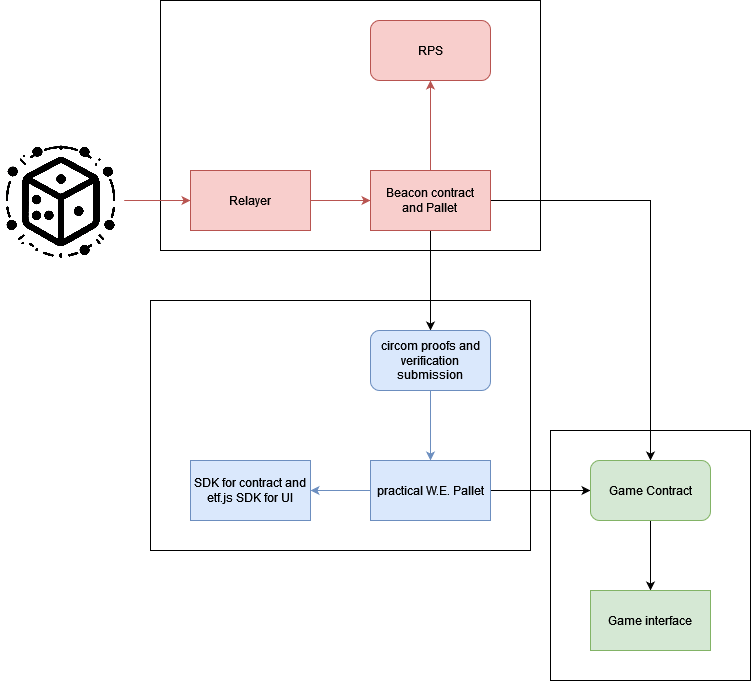
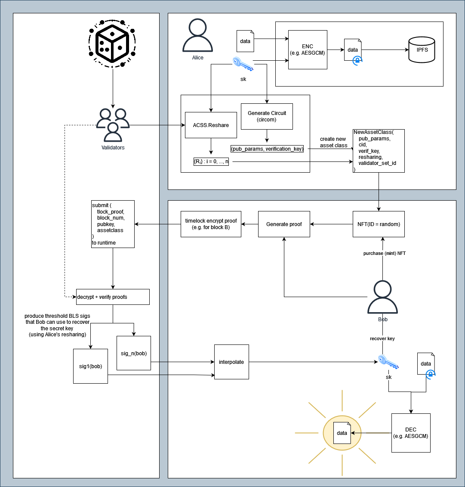
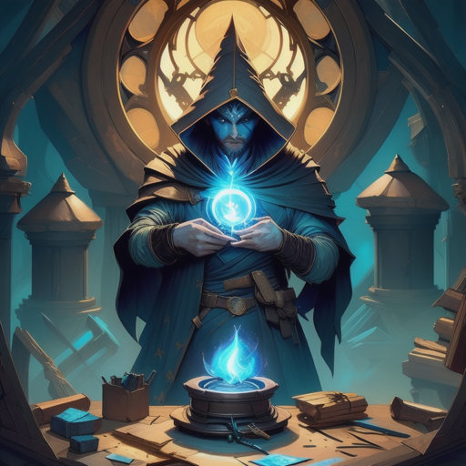

# Autonomous Worlds and Conditional Access Control on Substrate

- **Team Name:** Ideal Labs and Chainsafe Systems
- **Funding Details:**
  - **DOT**: For the **DOT** compensation, please provide a Polkadot address. (ex. multisig, with core contributors)

## Game Project Overview :page_facing_up:

# Game Project Application Form

## 1. Pitch the Game

### Please describe the game in a short pitch.

> Disclaimer: This is not only a pitch for a game, but for a web3 gaming framework. The final output of this proposal will be a game, which Ideal Labs will develop in collaboration with Chainsafe Systems. 

While Web3 games inherit many benefits from their trustless architecture, providing players with greater control and ownership over assets, gameplay and future development, it comes at a cost. Traditional online gaming's trusted infrastructure allows for the easy injection of randomness into gameplay as well as easy multiparty interactions. In addition, web2 gaming infrastructure doesn't burden the player with issues such as front-running, which provides unfair advantages for dishonest players. In this proposal, we present a novel mechanism that introduces publicy verifiable on-chain randomness and timelock encryption capabilities for web3 games. 

This is a proposal for an [autonomous worlds](https://0xparc.org/blog/autonomous-worlds) framework for web3 games. Autonomous worlds are fully on-chain ‘worlds’ in which all state exists on-chain without relying on external, centralized components. While generally thought of in the context of gaming, ‘autonomous worlds’ can be considered more generally as an axiomatic system where the ‘state’ of the world can be openly updated and proved by any entity (i.e. without permission, with full autonomy). It uses the Ideal Network’s “ETF post-finality gadget” (ETF-PFG) to provide publicly verifiable on-chain randomness, timelock encryption, and practical witness encryption capabilities to games deployed on-chain. It allows for usage of randomness and timelock encryption in smart contracts and enables autonomously driven on-chain games (otherwise called autonomous worlds). We also introduce a relayer network which is responsible for calculating state changes offchain and providing proofs onchain. With this framework we aim to provide new capabilities to Substrate-native games. Similar to existing solutions such as MUD or Dojo, the framework relies on verifiable offchain computation of game states with verification of proofs and states on-chain. Our framework is intended to be extensible, allowing for many different proving systems to be leveraged, however for the time being we focus on Groth 16.

This framework provides the following features to Substrate-based web3 games:
- **Publicly Verifiable On-Chain Randomness**: Injection of publicly verifiable randomness into games, which can be used as input or output randomness and also forms a basis for async multiparty interactions. 
- **Timelock Encryption**: Timelock encryption allows messages to be encrypted such that they can only be decrypted after a given amount of time, or in our case, blocks, has passed. Timelock encryption is a powerful primitive for enabling more trustless systems, where it enables more streamlined commit-reveal capabilities. In the context of gaming, it can provide front-running protection for players, time-based easter eggs and feature reveals, and generally the ability to ‘send something to the future’.
- **Trustless Secret Sharing and Conditional Access Control Mechanisms**: We introduce a new mechanism based on async committee secret sharing, timelock encryption and Groth16 that enables a trustless “practical witness encryption” scheme. We demonstrate how this can be used in order to incentivize a relayer network to automatically update game states and for the construction of new conditional access control mechanisms for web3 systems in general.

You can find the details of our proposed framework here: https://docs.google.com/document/d/1HYjl92HM-D6D3zYKfXIyvKz5PomhzIJgaPlmqFx5RN4/edit?usp=sharing

### Basic Gameplay Loop

TODO: Should we include the arcane assembler gameplay loop here?

### Are there any existing games that you would consider similar to your project?

There are several existing 'autonomous worlds' frameworks that exist, generally targeting EVM-based blockchains, including:
- [dojo](https://book.dojoengine.org/)
- [mud](https://mud.dev/)
- [xaya](https://xaya.io/)

Quite differently from those solutions, our solution also has the advantage of publicly verifiable on-chain randomness and timelock encryption, which will lead to more dynamic user experiences than what can be accomplished with existing solutions.

### Do you have a Game Design Document (GDD) for your project?

The GDD is a work in progress. Once complete, it will contain the full details of the game that we will build in collaboration with Chainsafe.

https://chainsafe.notion.site/Game-Design-Document-for-Fragments-70ad7d8efec14fa68de9f6f4e5be55f4

## 2. Game Dev Experience

### Have you built games prior to this bounty request?

#### Martin

- **[Isonzo](https://youtu.be/GAv34SMEjMI)** 
* Advanced Kinematic Character Controller
* New behaviours on bots
* Development of challenge and achievements systems
* Game settings from scratch
* Lead audio programming development

#### More games we have developed:
- **[Beat Cancer](https://www.youtube.com/watch?v=9hnLrSvW220)**
- **[Planet Rabbit](https://www.youtube.com/watch?v=n0XyF6U4qGs)**
- **[Block Blasterz](https://github.com/ChainSafe/BlockBlasterz)**
- **[Total Domination Reborn](https://www.youtube.com/watch?v=TM_t7uJlHAA)**
- **[Raid: Shadow Legends](https://www.youtube.com/watch?v=gmwbHdJLadE)**
- **[Greedventory](https://store.steampowered.com/app/1895820/Greedventory/)**
- **[Mortal Hockey Arcade](https://www.youtube.com/watch?v=vvzMc2pZMIs)**
- **[Ghost Rider](https://drive.google.com/file/d/1yy-myQRMyyQe8ccw42qqGsWlQjEkN5ZQ/view?usp=sharing)**
- **[Gebeta/Manchala](https://play.google.com/store/apps/details?id=com.qenegames.gebeta)**
- **[Angrymals](https://angrymals.io/)**

### Do any of the previously mentioned games have a Web3 component?
Block Blasterz is a web3 game that uses Etherum for its in-game currency, lootboxes, fiat-to-crypto conversion, and an NFT Marketplace. It also allows for EVM-based cross chain asset transfers with the Block Racerz game. We have been building and extending autonmous worlds on Ethereum (MUD framework) and on Starknet (Dojo Framework). 

### Do you have experience in working with game engines, such as Unity & Unreal?
Yes, we have extensive experience working with Unity and in-depth knowledge building blockchain SDKs for Unity. We have also worked with Unreal Engine, but not as extensively as Unity. We have experience with all aspects of game development, including game design, game mechanics, game physics, and game asset creation.

## 3. Technical Expertise

### How much of your game logic do you intend to build on the blockchain?
- [ ] None, I just want a token.
- [ ] Only the Game Assets/NFTs should remain on-chain.
- [ ] Some mechanics will need to be on-chain.
- [x] This should be a fully on-chain game.
- [ ] Other: 

### Do you have any expertise in Blockchain Development?
- [ ] No, none at all.
- [ ] I know how the Blockchain works, but never developed anything in crypto.
- [x] I have EVM / SmartContract experience.
- [ ] I have only used SDK for my games on other platforms.
- [x] I know Rust & Substrate and can create basic runtime code.
- [x] Other: Highly experienced in Rust & Substrate and can develop new runtime code.

### Would you like a technical Team from Polkadot Play, to help you identify the technical requirements?
Yes, we would. While we believe we have an excellent understanding of the technical requirements for this proposal, we would very much appreciate another look/perspective, as there undoubtedly some unknowns or things we may have overlooked. We would also appreciate insights into the direction of our tools and APIs to ensure that they are reasonable and serve as useful interfaces for developers.

## 4. The Team

### Could you share insights about team members who are essential to your project's success? Highlight their specific skill sets and contributions to the game development. 

(ordered alphabetically)

#### Juan Girini
Juan Girini is a Co-founder and Engineer at Ideal Labs, and a former FRAME Core Engineer at Parity. He holds a degree in Information Systems Engineering and is distinguished as a graduate of the Polkadot Blockchain Academy's Buenos Aires cohort with honours. With extensive experience as a web2 engineer before transitioning to web3, Juan is immersed in the development of the Ideal Network, a groundbreaking Substrate-based blockchain with a focus on pioneering novel blockchain functionalities. There's a particular emphasis on Onchain Randomness, as well as Interoperability, Timelock Encryption, and Delayed Transactions.

#### Coleman Irby
Coleman Irby graduated in 2015 with his Bachelor's of Science in Electrical Engineering with a focus in Computer Engineering from the University of Mississippi. In 2016, Coleman was hired as a contractor in software engineering. He then spent 6 years working as a software engineer in the Financial Technology sector. During his time he taught himself many different technologies including, but not limited to, Java, C++, React, Angular, Kotlin, Javascript, and many others. In 2022, Coleman then decided to return back to the University of Mississippi to pursue his Masters degree in physics. While pursuing his masters, Coleman has joined as an engineer  at Ideal Labs where he can apply his knowledge in mathematics, scientific modeling, and software engineering to help pioneer the technologies of the future.

#### Martin Maurer
Blockchain Developer with experience in Substrate, Rust, and Solidity smart contracts. Game Designer and technical artist with experience in Unity and Unreal Engine. Proficient in 3D modeling, texturing, and animation. Technical Project Manager with experience in Agile methodologies and Scrum at ChainSafe Systems.

#### Carlos Montoya
Carlos is a Co-Founder and Blockchain Engineer at Ideal Labs. His career has spanned over two decades, during which he has gathered extensive experience as a serial entrepreneur and software engineer. He has worked both in the realm of corporate software development and in the dynamic world of startups. He has been 5x CTO in companies such StellarEmploy (with exit), TeamClass, AccelEQ, Metatate, and Global MVM. His academic journey includes a Master's degree from Carnegie Mellon University, and most recently he attended the Polkadot Blockchain Academy in Buenos Aires, where Ideal Labs formed.

#### Tony Riemer

Tony is a co-founder of Ideal Labs, where he is the driving force behind protocol research and development at Ideal Labs. He studied mathematics at the University of Wisconsin, after which he gained experience working as a software engineer in the Fintech space, where he developed cutting edge solutions for Fannie Mae, Capital One, and others. In February 2023, he graduated from the PBA in Buenos Aires alongside the other co-founders of Ideal Labs. Since 2022 he has been fully immersed in everything web3. To date, he has successfully completed several web3 foundation grants and is committed to completing the vision of the "Ideal Network". He has a passion for mathematics, innovation, coffee, and cats. 

### Team Code Repos
All repos can be found under https://github.com/ideal-lab5
Specifically, we intend to heavily rely on or modify the following repositories:

- https://github.com/ideal-lab5/etf
- https://github.com/ideal-lab5/polkadot-ks
- https://github.com/ideal-lab5/etf-sdk
- https://github.com/ideal-lab5/etf.js
- https://github.com/ideal-lab5/contract
- https://github.com/ideal-lab5/fragments
- https://github.com/ideal-lab5/simple-relayer

### Team LinkedIn Profiles (if available)
- [Martin Maurer](https://www.linkedin.com/in/martin-maurer-hh/)
- [Tony Riemer](https://www.linkedin.com/in/tony-riemer/)
- [Carlos Montoya](https://www.linkedin.com/in/cmonvel/)
- [Coleman Irby](https://www.linkedin.com/in/coleman-irby-229b13103/)
- [Juan Girini](https://www.linkedin.com/in/juan-girini/)

## 5. Development

### Development Status :open_book:

The Ideal Network is a substrate-based chain with a novel consensus mechanism (as a post finality gadget) enabling publicly verifiable on-chain randomness and timelock encryption. Our development thus far has been exclusively funded by the web3 foundation, both through the open grants program and now as part of the Decentralized Futures initiative: https://medium.com/web3foundation/decentralized-futures-introducing-etf-network-cd8282be6143.

The Ideal Labs github is here: https://github.com/ideal-lab5 where you can find the repositories we will use in developing this proposal, including the [ETF repo](https://github.com/ideal-lab5/etf), [etf.js](https://github.com/ideal-lab5/etf.js), and [etf-sdk](https://github.com/ideal-lab5/etf-sdk).

Specificially in relation to the milestones you will encounter below, we have already begun development of milestone 1 (an experimental "lite" version). You can find the 'beacon' component here https://github.com/ideal-lab5/beacon. We have also begun modifying our runtime to support this. In addition, we implemented a basic version of rock-paper-scissors: https://github.com/ideal-lab5/rock-paper-scissors/.

You can read more about how it works at: https://medium.com/@ideal_labs/the-etf-post-finality-gadget-1dd6d7f12034
We have previously built some proof-of-concept games on the Ideal Network, such as: https://ideallabs.substack.com/p/p2p-semi-autonomous-games-part-3?utm_source=profile&utm_medium=reader2

### What are the key milestones for your game's development, and what are the estimated completion dates for each?

**Milestone 1:** Develop a **beacon contract** and centralized **relayer component**.

  This milestone delivers the core of the underlying infrastructure that enables our solution. Similar to BEEFY, the [ETF Post-Finality Gadget](https://medium.com/@ideal_labs/the-etf-post-finality-gadget-1dd6d7f12034)  works by broadcasting a stream of justifications that can be subscribed to. This milestone implements a centralized relayer component that relays ETF justifications to a smart contract light client called a 'beacon contract'. The relayer is responsible for interpolating threshold signatures, aggregating proofs, and sending transactions to a smart contract. This forms the basis for enabling randomness and timelock encryption capabilities for the game contract and for enabling autonomously driven experiences. We demonstrate how a game can use a beacon by implementing a simple PvE rock-paper-scissors game. We also will develop a pallet version of the beacon along with a chain extension, which we will use to re-implement the way the RPS game gets randomness.

  

  The beacon contract and pallet have nearly identical functionality:
  - `init`: initialize the beacon contract
  - `write_block`: allows a whitelisted relayer to write a block, then verifies the proof
  - `read_block`: read a signature produced for a given block

**Milestone 2:** Timelocked Transactions and Verifiable Computation

The goal of milestone to is to enable a mechanism where the Ideal network is capable of sharing secrets between async and anonymous participants. That is, we propose an MPC solution that uses zkSNARKS and our threshold BLS signature scheme to introduce an on-chain conditional access control mechanism wherein 'data owners' can define on-chain conditions that gate access to their data. This is conceptually similar to approaches taken by existing solutions, such as [dojo](https://www.dojoengine.org/en/). The mechanism that we are proposing could provide value beyond gaming, however, we see it as a tremendous value in the context of web3 gaming as well. Similar to existing frameworks, this mechanism also forms the basis for providing automatic or game state updates as well.

We intend to use [circom](https://github.com/iden3/circom), based on work done by [bright](https://brightinventions.pl/blog/zk-snarks-in-substrate-part-1/), to enable offchain computation which is later verifiable on-chain.

We introduce a new pallet to our runtime that manages and incentivizes participants (likely the network relayers, described in milestone (1)) to verify proofs, execute computations, and provide proofs to games thus updating the game state. Our mechanism leverages timelock encryption and asynchronous complete secret sharing in order to accomplish this (these already exist within the Ideal network), with the general idea being:

1. Alice has some secret data that she wants to make available to whoever meets some on-chain condition. She doesn't care who it is. So she encrypts her data with a stream cipher and then prepares a 'resharing' of her secret key to the network validator set. She creates a new onchain asset class associated with her public paramters.
2. Bob purchases an NFT minted from Alice's asset class. He then uses the public paramters to create a proof (zkSNARK) that satisfies Alice's on-chain condition. In practice, this condition will be: prove you own the NFT, though in theory it could be anything.
3. Bob timelock encrypts his proof for a specific future block and submits the payload to the Ideal network. 
> a quick aside: the reason timelock encryption is used is to ensure that network authorities produce signatures for Bob at the same time. We don't want Bob to have to trawl through signatures of different blocks to try to identify the valid ones. We also don't want validators to be able to cherry-pick which proofs they verify. By forcing validators to run timelock decryption, they are incentivized to verify it due to the extra work involved in decryption.
4. We assume the beacon pallet is implemented in the network. Network validators watch incoming blocks from the beacon pallet and then are incentivized to decrypt payloads, verify them, and produce valid signatures for Bob. They do this in a way that lets Bob easily identify the signatures he needs to interpolate as well as ensure that only Bob can use the resulting signature to decrypt the Payload.

In the context of Web3 gaming, we want process game states offchain and prove the computation on-chain. We can use the same approach that we described above with a little twist. Alice's payload, in this case, would in fact be some type of reward, likely a monetary one, or rather would give the executor access to account in which that reward exists. We use this idea to incentivize relayers to udpate game states. 

> Q: Should we go this far right now? this piece should probably be its own milestone, making this a 4 milestone proposal, though we could potentially trim away milestone 1 since it's already partially started. I feel that automatically driven contracts are not really necessary unless we want to create an on-chain simulation.

That is, from a relayer perspective, the goal would be to be the node who acts as 'Bob' in the scheme above, where they calcualate a proof (probably based on data stored in a contract's storage) in order to get a final signature. They use this signature as a secret key to get access to an account that contains a reward. This is the reward they receive for updating the game state.

This practical witness encryption capability has great potential to enable interesting new paradigms for web3 games. For example:
- It could enable conditional access to in-game assets, perhaps certain items are unavailable to a type of character or a only usable if they have reached a certain level.
- It could ensure players can only unlock new levels or achievements if they can prove they finished the previous ones. 
- It enables secure sharing of secrets between players, including trading of in-game assets. 

> Needs work
Finally, the outcome of this milestone is a modification of our rock-paper-scissors game, in which we enable a PvP competitive RPS game. Players will be able to challenge each other and play on-demand, where beforehand they agree on the block schedule when games must occur.  

**Milestone 3**: Re-Implement the game interface and assets

The final milestone re-imagines a game previously implemented using the Dojo framework and implements it as a substrate-native game instead. [Arcane Assembly](https://github.com/ArcaneAssemblers/spellcrafter) is a single player time and resource management survival game. You play as a mage trying to craft the most powerful spell the world has ever seen. Spells are crafted by sourcing and adding rare components from across the world.

First we reimplement the contracts (for example, [this one](https://github.com/ArcaneAssemblers/spellcrafter/blob/main/contracts/src/systems.cairo#L69C14-L69C15)) as ink! contracts, we also use the Ideal network's randomness within the game, for example replacing [this line](https://github.com/ArcaneAssemblers/spellcrafter/blob/cfe1cc3f45e434da4715177bca1d674214959b61/contracts/src/systems.cairo#L69C14-L69C15) with a call to get randomness from a beacon pallet instead.

### Are you intending to raise more funds?
There are no plans to raise additional funds right now, but we are open to discussing this in the future. The community reception of the game will be a significant factor in determining whether we will seek additional funding. Successful completion of proof-of-concept for the game mechanic will likely lead to further development. Crowd-funding is the most suitable funding model for the future.

## 6. Detailed Development Roadmap :nut_and_bolt:

### Overview

- **Total Estimated Duration:** 12 weeks
- **Full-Time Equivalent (FTE):**  4
- **Total Costs:** 4080 DOT

Estimations:
engineer at 3 DOT/hr (that's pretty low, maybe we can go higher)
FTE = 40 hr/week

### Milestone 1: Smart Contract Light Client + Relayer

- **Estimated duration:** 4 weeks
- **FTE:**  3
- **Costs:** 720 DOT ( = 3 * 2 * 40 * 3)

| Number | Deliverable | Specification |
| -----: | ----------- | ------------- |
| **0a.** | License | Specify the IP owning entity; ensure proper copyright compliance for all reused materials, including appropriate licenses and attributions, or choose an open-source license (Apache 2.0, GPLv3, MIT, Unlicense). |
| **0b.** | Documentation | Provide comprehensive **inline documentation** of the code and a detailed **tutorial**. The tutorial should guide users on how to set up, play the game, and assess the milestone's deliverables, ensuring functionality and compliance with the milestone objectives. |
| **0c.** | Testing and Testing Guide | Core functions will be fully covered by comprehensive unit tests to ensure functionality and robustness. In the guide, we will describe how to run these tests. |
| **0d.** | Platform | Provide a detailed description of the game's platform compatibility and the infrastructure setup required to host and run the game, including supported operating systems, hardware requirements, and necessary backend services. |
| 0e. | Article | We will publish an **article**/workshop that explains [...] (what was done/achieved as part of the games bounty). (Content, language, and medium should reflect your target audience described above.) |
| 1. | Ideal Network - Runtime and Pallets Upgrade (2 weeks) | We modify the Ideal Network runtime to enable the "Smart Contract Light Client". This includes creating a new pallet to store cryptographic commitments required for efficient onchain verification of ETF justifications with the smart contract.  |
| 2. | Centralized Relayer Component (1 week) | We implement a centralized relayer which is responsible for subscribing to ETF justifications, interpolating signatures and aggregating proofs, and sending the aggregated messages to the SCLC. |
| 3. | Smart Contract: The "beacon" Contract (1 week) | We develop and deploy the actual smart contract light client. |
| 4. | Demo Contract: Rock Paper Scissors **Part 1** (1 week) | We develop a rock-paper-scissors demo contract that consumes randomness from the SCLC and uses it in a meaningful way (to play p2p non-interactive RPS). |
| 5. | Pallet: The "beacon" Pallet (1 week) | We develop and deploy a pallet that accepts interpolated signaures and proofs, following the same logic as the beacon contract. We include this within our runtime. |
| 6. | Demo Contract: Rock Paper Scissors **Part 2** (1 week) | We develop a rock-paper-scissors demo contract that consumes randomness from the SCLC and uses it in a meaningful way (to play p2p non-interactive RPS). |

### Milestone 2: Framework Development

- **Estimated Duration:** 4 weeks
- **FTE:**  3.5
- **Costs:**

| Number | Deliverable | Specification |
| -----: | ----------- | ------------- |
| **0a.** | License | Specify the IP owning entity; ensure proper copyright compliance for all reused materials, including appropriate licenses and attributions, or choose an open-source license (Apache 2.0, GPLv3, MIT, Unlicense). |
| **0b.** | Documentation | Provide comprehensive **inline documentation** of the code and a detailed **tutorial**. The tutorial should guide users on how to set up, play the game, and assess the milestone's deliverables, ensuring functionality and compliance with the milestone objectives. |
| **0c.** | Testing and Testing Guide | Core functions will be fully covered by comprehensive unit tests to ensure functionality and robustness. In the guide, we will describe how to run these tests. |
| **0d.** | Platform | Provide a detailed description of the game's platform compatibility and the infrastructure setup required to host and run the game, including supported operating systems, hardware requirements, and necessary backend services. |
| 0e. | Article | We will publish an **article**/workshop that explains [...] (what was done/achieved as part of the games bounty). (Content, language, and medium should reflect your target audience described above.) |
| 1. | Library: Circom support in etf-sdk and etf.js | We develop documentation and tooling that allows users to perform AES-GCM encryption and prepare resharings of their secrets from rust and javascript by adding additional wasm bindings to our etf-sdk library. |
| 2. | Substrate Runtime: pallet-witness-encryption (part 1) | We develop a new pallet for enabling practical on-chain witness encryption. The pallet functions as described above, where users encode public parameters for circuits and resharings of the associated secret in a pallet, which is then associated with a new on-chain asset class. We adapt this from the work done by [bright](https://brightinventions.pl/blog/zk-snarks-in-substrate-part-1/). Note: This intermediate step does not modify validator logic yet. |
| 3. | Substrate Runtime: pallet-witness-encryption (part 2) | We modify the pallet to include an offchain worker that uses the latest signatures from the beacon pallet and uses the value to decrypt timelocked payloads and verify them, before creating a threshold BLS signature and storing it in runtime storage. |
| 4. | Substrate Module: pallet-scheduler | We implement a relayer incentive layer as a modified version of the scheduler pallet as discussed above. |
| 5. | | |
| 6. | | |
### Milestone 3: Game Development

- **Estimated Duration:** 4 weeks
- **FTE:**  3.5
- **Costs:** 

| Number | Deliverable | Specification |
| -----: | ----------- | ------------- |
| **0a.** | License | Specify the IP owning entity; ensure proper copyright compliance for all reused materials, including appropriate licenses and attributions, or choose an open-source license (Apache 2.0, GPLv3, MIT, Unlicense). |
| **0b.** | Documentation | Provide comprehensive **inline documentation** of the code and a detailed **tutorial**. The tutorial should guide users on how to set up, play the game, and assess the milestone's deliverables, ensuring functionality and compliance with the milestone objectives. |
| **0c.** | Testing and Testing Guide | Core functions will be fully covered by comprehensive unit tests to ensure functionality and robustness. In the guide, we will describe how to run these tests. |
| **0d.** | Platform | Provide a detailed description of the game's platform compatibility and the infrastructure setup required to host and run the game, including supported operating systems, hardware requirements, and necessary backend services. |
| 0e. | Article | We will publish an **article**/workshop that explains [...] (what was done/achieved as part of the games bounty). (Content, language, and medium should reflect your target audience described above.) |
| 1. | GDD: R & D | We perform research and complete the GDD alongside Chainsafe. We have already begun work on the GDD, however at this point it contains ideas that lead to the formulation of this framework and an initial idea for a game, though we will modify it during this deliverable. This task also includes the development of click-dummies that will be useful for the rest of the game development. |
| 2. | BSA | We will create an Blockchain Solution Architecture (BSA) showing the proper interaction of the game with the Blockchain elements. This will mostly be known as an output of milestone 2, however we will formalize the documentation here. |
| 3. | Game Contracts Reimplementation | We reimplement the game as a series of ink! smart contracts instead of starknet contracts. We also use the Beacon pallet's randomness within the contract. |
| 4. | | |
| 5. | Launch and Deploy | We launch the game on the Ideal network's testnet. | 

## 7. Future Plans

Please include here

- how you intend to finance the project's long-term maintenance and development,
  - Ideal Labs has been funded completely by non-dilutive grants. We have no specific plans for securing external, dilutive funding (e.g. V.C. funding), however, long-term maintenance and development of the project will depend on the success of our current participation in the [Decentralized Futures program](https://medium.com/web3foundation/decentralized-futures-introducing-etf-network-cd8282be6143) as well as the outcomes of our work on this proposal. We may seek external funding if needed, otherwise we will attempt to remain bootstrapped as long as possible, potentially seeking funds from the treasury.
- how you intend to use, enhance, and promote your project in the short term, and
  - In terms of gaming, we intend to use the framework we develop to create new web3 gaming solutions for Substrate/Polkadot based chains. Specifically, we want to develop fully on-chain games based on novel cryptographic solutions (e.g. circom for zksnarks, on-chain simulations based on markov chains that receive random inputs, or other crazy ideas). We want to approach web3 game developers and introduce them to these new capabilities in order to draw more focus to Polkadot's capabilities for web3 gaming (which we will do by showcasing our game).
- the team's long-term plans and intentions in relation to it.
  - we intend to launch the Ideal Network as a parachain
  - The team is also committed to non-gaming aspects of the project, which in a more general sense is the development of an on-chain 'randomness market', where individual entities (smart contracts, other chains, whoever) can bid to consume randomness from the network in an auction-based system.

## 8. Additional Information :heavy_plus_sign:

### While we've covered a range of topics, there might still be questions or areas of uncertainty on your side or ours. We encourage you to share any additional thoughts, questions, or concerns you may have, with us.

### How did you hear about the Grants Program?
- [ ] Polkadot Play Website
- [ ] Twitter
- [ ] Medium
- [x] Personal recommendation
- [x] Other: github, polkadot forum
