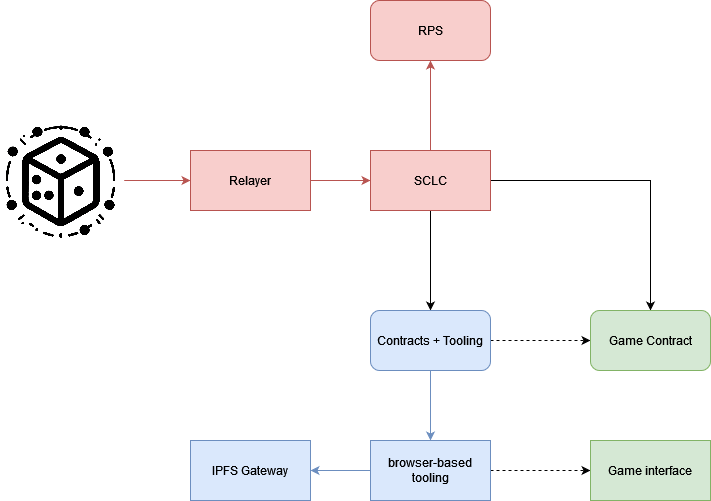
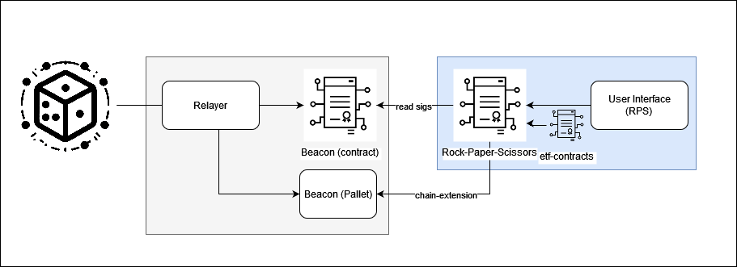

# Decentralized Web3 Event Clock
###### Autonomous Worlds on Polkadot

- **Team Name:** Ideal Labs and Chainsafe Systems
- **Funding Details:**
  - **DOT**: For the **DOT** compensation, please provide a Polkadot address. (ex. multisig, with core contributors)

## Game Project Overview :page_facing_up:

# Game Project Application Form

## 1. Pitch the Game

### Please describe the game in a short pitch.

> Disclaimer: This is not only a pitch for a game, but for a framework. The final output of this proposal will be a game, which Ideal Labs will develop in conjunction with Chainsafe Systems, however we have not yet determined an optimal concept/theme to showcase the capabilities of our framework. As such, we propopse to develop some small examples which will culminate in a larger game built with Chainsafe. 

While Web3 games inherit many benefits from their trustless architecture, providing players with greater control and ownership over assets, gameplay and future development, it comes at a cost. Traditional online gaming's trusted infrastructure allows for the easy injection of randomness into gameplay as well as easy multiparty interactions (i.e. coin-flipping protocols). In addition, web2 gaming infrastructure doesn't burden the player with issues such as front-running, which provides unfair advantages for dishonest players. In this proposal, we present a novel mechanism that introduces publicy verifiable on-chain randomness and timelock encryption capabilities for web3 games. 

In this proposal we introduce a mechanism that introduces new [autonomous world](https://0xparc.org/blog/autonomous-worlds) capabilities for substrate-native web3 games. Our framework intends to be used for building fully on-chain games on Substrate based chains. We also enable support for verifiable computations, allowing use cases like those describerd in [zkHunt](https://0xparc.org/blog/zk-hunt). Beyond support for verifiable computations,  we propose a mechanism that injects publicly verifiable on-chain randomness and provides efficient timelock encryption capabilities, giving games the power to be both autonomously driven and non-deterministic while retaining decentralization. This will allow for new kinds of use cases for web3 games, such as atomic asset swaps, dynamic in-game events, "endless" time-based games, autonomously driven gameplay (e.g. an on-chain simulation), and more.

We accomplish this through the Ideal network, a Substrate-based blockchain which implements a post-finality gadget (ETF-PFG) that produces a publicly verifiable randomness beacon via threshold BLS signatures and DLEQ proofs. It functions similar to BEEFY and allows for the network to provide cross-chain randomness through a relayer and light client.  Our solution will enable:

- interoperable, publicly verifiable, on-chain randomness
- efficient timelock encryption for games
- autonomously driven, non-deterministic games

You can find the details of our proposed framework here: https://docs.google.com/document/d/1HYjl92HM-D6D3zYKfXIyvKz5PomhzIJgaPlmqFx5RN4/edit?usp=sharing

### Basic Gameplay Loop

TODO

### Are there any existing games that you would consider similar to your project?

There are several existing 'autonomous worlds' frameworks that exist, generally targeting EVM-based blockchains, including:
- [dojo](https://book.dojoengine.org/)
- [mud](https://mud.dev/)
- [xaya](https://xaya.io/)

Very differently from those solutions, our solution also has the advantage of publicly verifiable on-chain randomness and timelock encryption, which will lead to more dynamic user experiences than what can be accomplished with existing solutions.

### Do you have a Game Design Document (GDD) for your project?

The GDD is a work in progress. Once complete, it will contain the full details of the game that we will build in collaboration with Chainsafe.

https://chainsafe.notion.site/Game-Design-Document-for-Fragments-70ad7d8efec14fa68de9f6f4e5be55f4

## 2. Game Dev Experience

### Have you built games prior to this bounty request?

#### Martin

- **[Isonzo](https://youtu.be/GAv34SMEjMI)** 
* Advanced Kinematic Character Controller
* New behaviours on bots
* Development of challenge and achievements systems
* Game settings from scratch
* Lead audio programming development

#### More games we have developed:
- **[Beat Cancer](https://www.youtube.com/watch?v=9hnLrSvW220)**
- **[Planet Rabbit](https://www.youtube.com/watch?v=n0XyF6U4qGs)**
- **[Block Blasterz](https://github.com/ChainSafe/BlockBlasterz)**
- **[Total Domination Reborn](https://www.youtube.com/watch?v=TM_t7uJlHAA)**
- **[Raid: Shadow Legends](https://www.youtube.com/watch?v=gmwbHdJLadE)**
- **[Greedventory](https://store.steampowered.com/app/1895820/Greedventory/)**
- **[Mortal Hockey Arcade](https://www.youtube.com/watch?v=vvzMc2pZMIs)**
- **[Ghost Rider](https://drive.google.com/file/d/1yy-myQRMyyQe8ccw42qqGsWlQjEkN5ZQ/view?usp=sharing)**
- **[Gebeta/Manchala](https://play.google.com/store/apps/details?id=com.qenegames.gebeta)**
- **[Angrymals](https://angrymals.io/)**

### Do any of the previously mentioned games have a Web3 component?
Block Blasterz is a web3 game that uses Etherum for its in-game currency, lootboxes, fiat-to-crypto conversion, and an NFT Marketplace. It also allows for EVM-based cross chain asset transfers with the Block Racerz game. We have been building and extending autonmous worlds on Ethereum (MUD framework) and on Starknet (Dojo Framework). 

### Do you have experience in working with game engines, such as Unity & Unreal?
Yes, we have extensive experience working with Unity and in-depth knowledge building blockchain SDKs for Unity. We have also worked with Unreal Engine, but not as extensively as Unity. We have experience with all aspects of game development, including game design, game mechanics, game physics, and game asset creation.

## 3. Technical Expertise

### How much of your game logic do you intend to build on the blockchain?
- [ ] None, I just want a token.
- [ ] Only the Game Assets/NFTs should remain on-chain.
- [ ] Some mechanics will need to be on-chain.
- [x] This should be a fully on-chain game.
- [ ] Other: 

### Do you have any expertise in Blockchain Development?
- [ ] No, none at all.
- [ ] I know how the Blockchain works, but never developed anything in crypto.
- [x] I have EVM / SmartContract experience.
- [ ] I have only used SDK for my games on other platforms.
- [x] I know Rust & Substrate and can create basic runtime code.
- [x] Other: Highly experienced in Rust & Substrate and can develop new runtime code.

### Would you like a technical Team from Polkadot Play, to help you identify the technical requirements?
Yes, we would. While we believe we have an excellent understanding of the technical requirements for this proposal, we would very much appreciate another look/perspective, as there undoubtedly some unknowns or things we may have overlooked. We do not have any specific pain points at the moment. In addition, we would appreciate technical expertise in reviewing our game logic and implementation, as we have not developed a production-ready ink! based game before.

## 4. The Team

### Could you share insights about team members who are essential to your project's success? Highlight their specific skill sets and contributions to the game development. 

(ordered alphabetically)

#### Juan Girini
Juan Girini is a Co-founder and Engineer at Ideal Labs, and a former FRAME Core Engineer at Parity. He holds a degree in Information Systems Engineering and is distinguished as a graduate of the Polkadot Blockchain Academy's Buenos Aires cohort with honours. With extensive experience as a web2 engineer before transitioning to web3, Juan is immersed in the development of the Ideal Network, a groundbreaking Substrate-based blockchain with a focus on pioneering novel blockchain functionalities. There's a particular emphasis on Onchain Randomness, as well as Interoperability, Timelock Encryption, and Delayed Transactions.

#### Coleman Irby
Coleman Irby graduated in 2015 with his Bachelor's of Science in Electrical Engineering with a focus in Computer Engineering from the University of Mississippi. In 2016, Coleman was hired as a contractor in software engineering. He then spent 6 years working as a software engineer in the Financial Technology sector. During his time he taught himself many different technologies including, but not limited to, Java, C++, React, Angular, Kotlin, Javascript, and many others. In 2022, Coleman then decided to return back to the University of Mississippi to pursue his Masters degree in physics. While pursuing his masters, Coleman has joined as an engineer  at Ideal Labs where he can apply his knowledge in mathematics, scientific modeling, and software engineering to help pioneer the technologies of the future.

#### Martin Maurer
Blockchain Developer with experience in Substrate, Rust, and Solidity smart contracts. Game Designer and technical artist with experience in Unity and Unreal Engine. Proficient in 3D modeling, texturing, and animation. Technical Project Manager with experience in Agile methodologies and Scrum at ChainSafe Systems.

#### Carlos Montoya
Carlos is a Co-Founder and Blockchain Engineer at Ideal Labs. His career has spanned over two decades, during which he has gathered extensive experience as a serial entrepreneur and software engineer. He has worked both in the realm of corporate software development and in the dynamic world of startups. He has been 5x CTO in companies such StellarEmploy (with exit), TeamClass, AccelEQ, Metatate, and Global MVM. His academic journey includes a Master's degree from Carnegie Mellon University, and most recently he attended the Polkadot Blockchain Academy in Buenos Aires, where Ideal Labs formed.

#### Tony Riemer

Tony is a co-founder of Ideal Labs, where he is the driving force behind protocol research and development. He studied mathematics at the University of Wisconsin, after which he gained experience working as a software engineer in the Fintech space, where he developed cutting edge solutions for Fannie Mae, Capital One, and others. In February 2023, he graduated from the PBA in Buenos Aires alongside the other co-founders of Ideal Labs. Since 2022 he has been fully immersed in everything web3. To date, he has successfully completed several web3 foundation grants and is committed to completing the vision of the "Ideal Network". He has a passion for mathematics, innovation, coffee, and cats. 

### Team Code Repos
All repos can be found under https://github.com/ideal-lab5
Specifically, we intend to heavily rely on or modify the following repositories:

- https://github.com/ideal-lab5/etf
- https://github.com/ideal-lab5/polkadot-ks
- https://github.com/ideal-lab5/etf-sdk
- https://github.com/ideal-lab5/etf.js
- https://github.com/ideal-lab5/contract
- https://github.com/ideal-lab5/fragments
- https://github.com/ideal-lab5/simple-relayer

### Team LinkedIn Profiles (if available)
- [Martin Maurer](https://www.linkedin.com/in/martin-maurer-hh/)
- [Tony Riemer](https://www.linkedin.com/in/tony-riemer/)
- [Carlos Montoya](https://www.linkedin.com/in/cmonvel/)
- [Coleman Irby](https://www.linkedin.com/in/coleman-irby-229b13103/)
- [Juan Girini](https://www.linkedin.com/in/juan-girini/)

## 5. Development

### Development Status :open_book:

The Ideal Network is a substrate-based chain with a novel consensus mechanism (as a post finality gadget) enabling publicly verifiable on-chain randomness and timelock encryption. Our development thus far has been exclusively funded by the web3 foundation, both through the open grants program and now as part of the Decentralized Futures initiative: https://medium.com/web3foundation/decentralized-futures-introducing-etf-network-cd8282be6143.

The Ideal Labs github is here: https://github.com/ideal-lab5 where you can find the repositories we will use in developing this proposal, including the [ETF repo](https://github.com/ideal-lab5/etf), [etf.js](https://github.com/ideal-lab5/etf.js), and [etf-sdk](https://github.com/ideal-lab5/etf-sdk).

Specificially in relation to the milestones you will encounter below, we have already begun development of milestone 1 (an experimental "lite" version). You can find the 'beacon' component here https://github.com/ideal-lab5/beacon. We have also begun modifying our runtime to support this. In addition, we implemented a basic version of rock-paper-scissors: https://github.com/ideal-lab5/rock-paper-scissors/. We have deployed the contract and UI to a testnet, which you can play at: https://rps.idealabs.network (if it doesn't work let Tony know and he'll resolve it).

You can read more about how it works at: https://medium.com/@ideal_labs/the-etf-post-finality-gadget-1dd6d7f12034
We have previously built some proof-of-concepts on the Ideal Network, such as: https://ideallabs.substack.com/p/p2p-semi-autonomous-games-part-3?utm_source=profile&utm_medium=reader2

### What are the key milestones for your game's development, and what are the estimated completion dates for each?

There are three major milestones to the proposal.

We expect each of the milestones to last 4 weeks.

**Milestone 1:** Develop a **beacon contract** and centralized **relayer component**.

  This milestone delivers the core of the underlying infrastructure that enables our solution. Similar to BEEFY, the [ETF Post-Finality Gadget](https://medium.com/@ideal_labs/the-etf-post-finality-gadget-1dd6d7f12034)  works by broadcasting a stream of justifications that can be subscribed to. This milestone implements a centralized relayer component that relays ETF justifications to a smart contract light client called a 'beacon contract'. The relayer is responsible for interpolating threshold signatures, aggregating proofs, and sending transactions to a smart contract. This forms the basis for enabling randomness and timelock encryption capabilities for the game contract and for enabling autonomously driven experiences. We demonstrate how a game can use a beacon by implementing a simple PvE rock-paper-scissors game. We also will develop a pallet version of the beacon along with a chain extension, which we will use to re-implement the way the RPS game gets randomness. 

  

  The beacon contract and pallet have nearly identical functionality:
  - `init`: initialize the beacon contract
  - `write_block`: allows a whitelisted relayer to write a block, then verifies the proof
  - `read_block`: read a signature produced for a given block

**Milestone 2:** Timelocked Transactions and Verifiable Computation

This milestone takes a lot of inspiration from existing 'autonomous worlds' approaches, especially that taken by [dojo](https://www.dojoengine.org/en/). In this milestone we develop a modular and extensible framework for building fully on-chain web3 games on Polkdaot. The core idea behind building a framework for fully on-chain games driven by verifiable randomness, in the sense of [autonomous worlds](https://0xparc.org/blog/autonomous-worlds), is that:
1. The ETF justifications are **diegetic** to the game, and their introduction rule into games is open, meaning anyone can introduce a valid signature and proof to a beacon. The game is 'driven' by the new signatures recieved by a beacon, but anybody can theoretically supply valid values to it. This ensures the world retains autonomy.
2. Game states should be calculated offchain using *some* type of verifiable computation scheme, with the updated state being verifiable on-chain.
3. The verifiable randomness beacon enables async coin-flip protocols within this framework. In another sense, this can be thought of 'the ability to secretly schedule something now and execute it later'. Async and anonymous players can participate in a synchronous protocol in this way, allowing for new types of 'multiparty interactions' that don't require commit-reveal patterns in the traditional sense. 

To accomplish this, we introduce a new pallet to the network, a 'relayer' pallet. 

By using timelock encryption, players can encrypt their decisions for the future and hand them off to a relayer. Once a relayer interpolates a signature, if can decrypt the transaction and dispatch it. Since the payload is timelock encrypted, relayers do not know the transaction beforehand, making it very difficult for them to perform MEV extraction. we can allow the system to be require less trust compared to similar solutions.

 The aims of this milestone are twofold. Firstly, we want to allow any number of async, potentially anonymous parties to interact in a protocol together. This is an important capability for web3 games, as it allows players 

 [circom](https://github.com/iden3/circom), based on work done by [bright](https://brightinventions.pl/blog/zk-snarks-in-substrate-part-1/), to enable offchain computation which is later verifiable on-chain. The outcome of this milestone is a modification of our rock-paper-scissors game, in which we enable PvP competitive games which are verified through a circom circuit. Our `Relayer` nodes will be made responsible for calculating game states and proofs, similar to Dojo's 'katana'. This milestone also delivers a new pallet that introduces a way from consumers to incentivize (pay) relayers to produce aggregated signatures for their games. This is a 'randomness market'.

**Milestone 3**: Implement the game interface and assets

### Are you intending to raise more funds?
There are no plans to raise additional funds right now, but we are open to discussing this in the future. The community reception of the game will be a significant factor in determining whether we will seek additional funding. Successful completion of proof-of-concept for the game mechanic will likely lead to further development. Crowd-funding is the most suitable funding model for the future.

## 6. Detailed Development Roadmap :nut_and_bolt:

### Overview

- **Total Estimated Duration:** 12 weeks
- **Full-Time Equivalent (FTE):**  4
- **Total Costs:** 4080 DOT

Estimations:
engineer at 3 DOT/hr (that's pretty low, maybe we can go higher)
FTE = 40 hr/week

### Milestone 1: Smart Contract Light Client + Relayer

- **Estimated duration:** 4 weeks
- **FTE:**  3
- **Costs:** 720 DOT ( = 3 * 2 * 40 * 3)

| Number | Deliverable | Specification |
| -----: | ----------- | ------------- |
| **0a.** | License | Specify the IP owning entity; ensure proper copyright compliance for all reused materials, including appropriate licenses and attributions, or choose an open-source license (Apache 2.0, GPLv3, MIT, Unlicense). |
| **0b.** | Documentation | Provide comprehensive **inline documentation** of the code and a detailed **tutorial**. The tutorial should guide users on how to set up, play the game, and assess the milestone's deliverables, ensuring functionality and compliance with the milestone objectives. |
| **0c.** | Testing and Testing Guide | Core functions will be fully covered by comprehensive unit tests to ensure functionality and robustness. In the guide, we will describe how to run these tests. |
| **0d.** | Platform | Provide a detailed description of the game's platform compatibility and the infrastructure setup required to host and run the game, including supported operating systems, hardware requirements, and necessary backend services. |
| 0e. | Article | We will publish an **article**/workshop that explains [...] (what was done/achieved as part of the games bounty). (Content, language, and medium should reflect your target audience described above.) |
| 1. | Ideal Network - Runtime and Pallets Upgrade (2 weeks) | We modify the Ideal Network runtime to enable the "Smart Contract Light Client". This includes creating a new pallet to store cryptographic commitments required for efficient onchain verification of ETF justifications with the smart contract.  |
| 2. | Centralized Relayer Component (1 week) | We implement a centralized relayer which is responsible for subscribing to ETF justifications, interpolating signatures and aggregating proofs, and sending the aggregated messages to the SCLC. |
| 3. | Smart Contract: The "beacon" Contract (1 week) | We develop and deploy the actual smart contract light client. |
| 4. | Demo Contract: Rock Paper Scissors **Part 1** (1 week) | We develop a rock-paper-scissors demo contract that consumes randomness from the SCLC and uses it in a meaningful way (to play p2p non-interactive RPS). |
| 5. | Pallet: The "beacon" Pallet (1 week) | We develop and deploy a pallet that accepts interpolated signaures and proofs, following the same logic as the beacon contract. We include this within our runtime. |
| 6. | Demo Contract: Rock Paper Scissors **Part 2** (1 week) | We develop a rock-paper-scissors demo contract that consumes randomness from the SCLC and uses it in a meaningful way (to play p2p non-interactive RPS). |

### Milestone 2: Framework Development

- **Estimated Duration:** 4 weeks
- **FTE:**  3.5
- **Costs:**

| Number | Deliverable | Specification |
| -----: | ----------- | ------------- |
| **0a.** | License | Specify the IP owning entity; ensure proper copyright compliance for all reused materials, including appropriate licenses and attributions, or choose an open-source license (Apache 2.0, GPLv3, MIT, Unlicense). |
| **0b.** | Documentation | Provide comprehensive **inline documentation** of the code and a detailed **tutorial**. The tutorial should guide users on how to set up, play the game, and assess the milestone's deliverables, ensuring functionality and compliance with the milestone objectives. |
| **0c.** | Testing and Testing Guide | Core functions will be fully covered by comprehensive unit tests to ensure functionality and robustness. In the guide, we will describe how to run these tests. |
| **0d.** | Platform | Provide a detailed description of the game's platform compatibility and the infrastructure setup required to host and run the game, including supported operating systems, hardware requirements, and necessary backend services. |
| 0e. | Article | We will publish an **article**/workshop that explains [...] (what was done/achieved as part of the games bounty). (Content, language, and medium should reflect your target audience described above.) |
| 1. | | |
| 2. | | |
### Milestone 3: Game Development

- **Estimated Duration:** 4 weeks
- **FTE:**  3.5
- **Costs:** 

| Number | Deliverable | Specification |
| -----: | ----------- | ------------- |
| **0a.** | License | Specify the IP owning entity; ensure proper copyright compliance for all reused materials, including appropriate licenses and attributions, or choose an open-source license (Apache 2.0, GPLv3, MIT, Unlicense). |
| **0b.** | Documentation | Provide comprehensive **inline documentation** of the code and a detailed **tutorial**. The tutorial should guide users on how to set up, play the game, and assess the milestone's deliverables, ensuring functionality and compliance with the milestone objectives. |
| **0c.** | Testing and Testing Guide | Core functions will be fully covered by comprehensive unit tests to ensure functionality and robustness. In the guide, we will describe how to run these tests. |
| **0d.** | Platform | Provide a detailed description of the game's platform compatibility and the infrastructure setup required to host and run the game, including supported operating systems, hardware requirements, and necessary backend services. |
| 0e. | Article | We will publish an **article**/workshop that explains [...] (what was done/achieved as part of the games bounty). (Content, language, and medium should reflect your target audience described above.) |
| 1. | GDD: R & D | We perform research and complete the GDD alongside Chainsafe. We have already begun work on the GDD, however at this point it contains ideas that lead to the formulation of this framework and an initial idea for a game, though we will modify it during this deliverable. This task also includes the development of click-dummies that will be useful for the rest of the game development. |
| 2. | BSA: ... | We will create an Blockchain Solution Architecture (BSA) showing the proper interaction of the game with the Blockchain elements. This will mostly be known as an output of milestone 2, however we will formalize the documentation here. |
| 3. | Frontend module: Browser-based game interface | We will create a user interface to interact with the game. The initial version will likely be browser based, without the use of unreal or unity. We make this choice since our approach is experimental and we must should validate it at scale before developing a fully-fledged game. |
| 4. | Asset Layer: TBD | We will create an asset layer consisting of those asset models that we determine are required as part of the research included in deliverabel (1).|

## 7. Future Plans

Please include here

- how you intend to finance the project's long-term maintenance and development,
  - Ideal Labs has been funded completely by non-dilutive grants. We have no specific plans for securing external, dilutive funding (e.g. V.C. funding), however, long-term maintenance and development of the project will depend on the success of our current participation in the [Decentralized Futures program](https://medium.com/web3foundation/decentralized-futures-introducing-etf-network-cd8282be6143) as well as the outcomes of our work on this proposal. We may seek external funding if needed, otherwise we will attempt to remain bootstrapped as long as possible, potentially seeking funds from the treasury.
- how you intend to use, enhance, and promote your project in the short term, and
  - In terms of gaming, we intend to use the framework we develop to create new web3 gaming solutions for Substrate/Polkadot based chains. Specifically, we want to develop fully on-chain games based on novel cryptographic solutions (e.g. circom for zksnarks, on-chain simulations based on markov chains that receive random inputs, or other crazy ideas). We want to approach web3 game developers and introduce them to these new capabilities in order to draw more focus to Polkadot's capabilities for web3 gaming (which we will do by showcasing our game).
- the team's long-term plans and intentions in relation to it.
  - we intend to launch the Ideal Network as a parachain
  - The team is also committed to non-gaming aspects of the project, which in a more general sense is the development of an on-chain 'randomness market', where individual entities (smart contracts, other chains, whoever) can bid to consume randomness from the network in an auction-based system.

## 8. Additional Information :heavy_plus_sign:

### While we've covered a range of topics, there might still be questions or areas of uncertainty on your side or ours. We encourage you to share any additional thoughts, questions, or concerns you may have, with us.

### How did you hear about the Grants Program?
- [ ] Polkadot Play Website
- [ ] Twitter
- [ ] Medium
- [x] Personal recommendation
- [x] Other: github, polkadot forum
